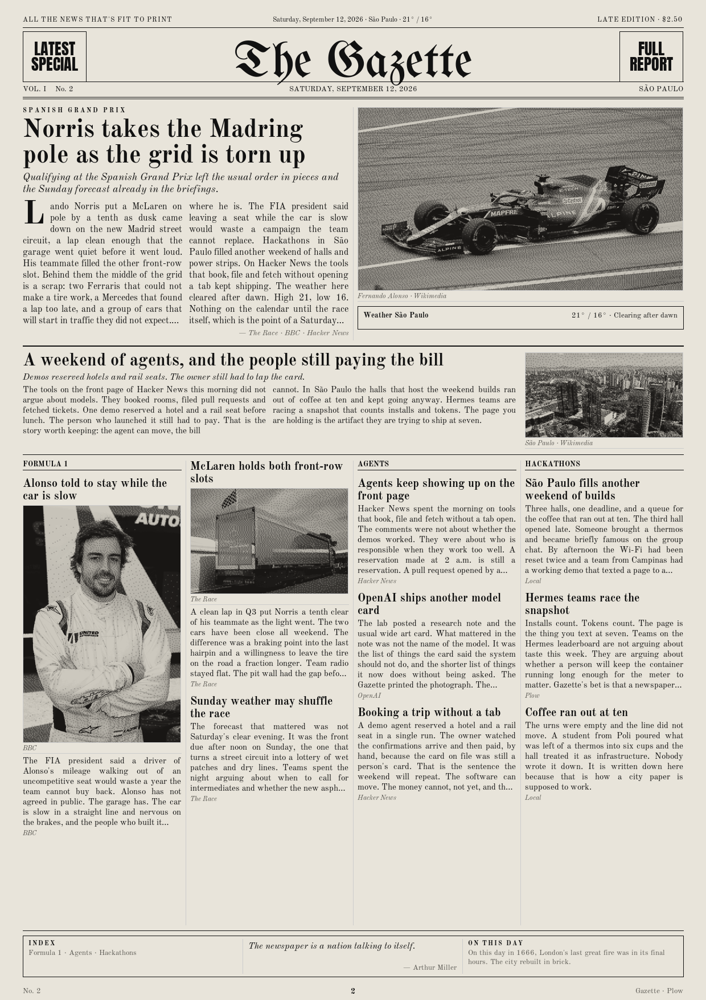
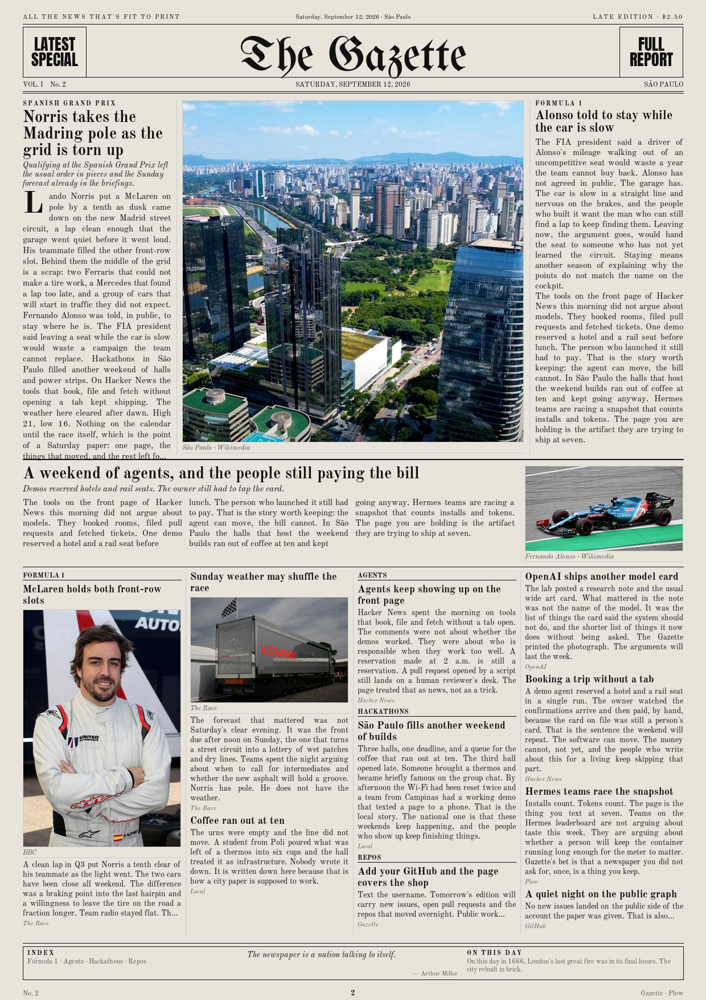
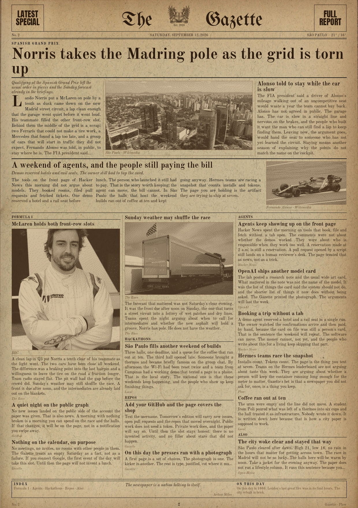

# Gazette

Your morning newspaper. An agent writes it overnight and texts you the page as a picture.

Weather for your city, the topics you follow, your GitHub repos, the day's calendar if you opt in, and one thing from history. One sheet. Laid out like a front page.

Times (black and white) · Planet (color) · Herald (sepia, 1912 cafe paper)

| [Times](docs/times.png) | [Planet](docs/planet.png) | [Herald](docs/herald.png) |
| :---: | :---: | :---: |
|  |  |  |

**Landing page:** https://get-gazette.vercel.app (source in [`site/`](site/), `npm run dev`). Legacy static version: [`docs/index.html`](docs/index.html).

A [Hermes](https://github.com/NousResearch/hermes-agent) agent packaged for [Plow](https://plow.co): your own phone line (iMessage / SMS / RCS), one Docker container, no model API keys. Inference goes through Plow with the credential you mint at install. MIT licensed.

## Install

You need [Docker](https://docs.docker.com/get-docker/) and a [Plow](https://plow.co) account. Windows, macOS, and Linux all work. The first build takes a few minutes.

```sh
# 1. Plow CLI (keep bin on your PATH)
git clone https://github.com/plow-pbc/plow-agents.git
export PATH="$PWD/plow-agents/bin:$PATH"          # PowerShell: $env:PATH = "$PWD\plow-agents\bin;$env:PATH"

# 2. Log in from the phone that owns the account. --new-line gives Gazette its own number.
plow-agents login --new-line
plow-agents lines                                 # pick a free ln_… id

# 3. This repo
git clone https://github.com/MAUXII/gazette.git
cd gazette
plow-agents mint ln_xxxxxxxx                      # writes ./plow-credentials. Never commit it.
docker compose up --build -d
```

Watch `docker compose logs -f agent` until you see `plow-init: configured`. Then text the new number anything. `hi` is fine.

Gazette asks four things: your **city**, **two to four topics**, your **GitHub username** (optional), and **what time** you want the paper. Answer in one message. It prints the first edition in that same turn and schedules the next one.

Keep the container running. The paper **lands** at the time you chose, in your timezone. The press starts about twenty minutes earlier so gather and layout finish first.

If `up` ran before `mint`, Docker may have created a `plow-credentials` directory. Tear it down and mint again:

```sh
docker compose down -v
rmdir plow-credentials          # PowerShell: Remove-Item -Recurse plow-credentials
plow-agents mint ln_xxxxxxxx
docker compose up --build -d
```

A pull of the base image from `public.ecr.aws` can 403 on stale Docker credentials. `docker logout public.ecr.aws`, then build again.

## Text it

| You say | It does |
|---|---|
| `print today's paper` / `again` / `one more` | a fresh edition, now |
| `use times` / `use planet` / `use herald` | lock the face (first install is Planet, color) |
| `rotate templates` | cycle the three faces by edition number |
| `reset` / `reset my profile` | wipe the profile (asks first); next `hi` is first contact |
| `color photos` / `black and white` | Times and Planet; Herald stays sepia |
| `share` / `send it again` | resends the latest page |
| `more on <story>` | that item, with its link |
| `add Formula 1` / `drop crypto` | topics |
| `deliver at 6:30` | delivery time, local |
| `I moved to Lisbon` | city, weather, timezone |
| `call it The Daily Ada` | masthead |
| `switch to Portuguese` | language of the paper and the feeds |
| `connect google` | calendar on the front (Plow Google connector) |

`fotos coloridas` and `preto e branco` work the same as the English photo commands.

## The three faces

- **Times**: broadsheet. Lead photograph up top, type in even columns.
- **Planet**: a square plate in the middle of the lead, type on both sides.
- **Herald**: 1912 cafe paper, walnut ink, stacked display hed, always sepia.

The first install is **Planet, color**. `rotate templates` cycles the three faces. Photographs sit on the lead and maybe one or two column items: real photos, not title cards. Not every column gets a picture; the type fills the sheet. Copy that overruns a box ends on a finished sentence. It never paints over the footer.

## What it reads

Public sources only, unless you opt in:

- [Open-Meteo](https://open-meteo.com) for weather
- Google News RSS for your topics
- Hacker News front page
- GitHub public API for your repos
- Wikipedia "on this day"

Nothing personal leaves the container. Google Calendar is opt-in (`connect google`): titles and times only, through your Plow account.

The agent does not browse on its own and does not invent a story. Every line on the page traces to an item `gather.py` fetched. If a source is down, the page says so in one line and moves on.

## Print a sample without Plow

Python 3.11+ and Pillow. Network is needed only for the photographs in the sample JSON.

```sh
python -m pip install pillow
python gazette/render.py --edition docs/sample-edition.json --out out/times.png --template times --date 2026-09-12
python gazette/render.py --edition docs/sample-edition.json --out out/planet.png --template planet --date 2026-09-12
python gazette/render.py --edition docs/sample-edition.json --out out/herald.png --template herald --date 2026-09-12
```

`docs/sample-edition.json` is a real edition. The three pages at the top of this README were rendered from it.

## How it works

```
your time  cron  →  gather.py  →  today.json  →  the model writes edition.json
                                                          │
     your phone  ←  MEDIA: line  ←  render.py (Pillow)  ←─┘
```

- `gazette/gather.py` fetches every source with the standard library. No model.
- The model (skill `gazette-edition`) reads `today.json` and writes `edition.json` against a fixed schema. That is the only step that spends tokens.
- `gazette/render.py` + `sheets.py`: A4 at 150 dpi (1240×1754), Pillow, three faces.
- The turn ends with `MEDIA:/srv/gazette/editions/<date>.png`. Plow uploads the photo.

The image is a variant of [`plow-pbc/plow-hermes-agent`](https://github.com/plow-pbc/plow-hermes-agent). The base owns boot, credentials, the phone line, and the model. This repo adds the persona, two skills, the producer, and the Agent Index reporter.

```
runtime/persona.md         who Gazette is
skills/gazette-setup/      onboarding and later changes
skills/gazette-edition/    the daily recipe
gazette/                   gather · render · sheets · images · write_config · register_cron · fonts · assets
image/                     HERMES_MEDIA_ALLOW_DIRS and the Index reporter
```

Config lives at `/var/lib/hermes/gazette/config.json` on the `gazette-home` volume. Editions live on `gazette-editions`. `docker compose down` keeps both. `docker compose down -v` wipes them.

## Agent Index

The image reports token usage to the [Agent Index](https://aiworthusing.com/agent-index) under `gazette` (`AGENT_ID` in `compose.yml`). Each install is one row. The reporter is the Plow base image's own; to stop reporting, set `AGENT_ID` empty in `compose.yml`.

## Credits

The morning-paper-as-a-picture idea was made popular by [Karen X. Cheng](https://x.com/karenxcheng). Gazette is the installable version, built for the Hermes Hackathon.

Fonts: Old Standard TT, Unifraktur Maguntia, and Anton, all SIL OFL (`gazette/fonts/`). Herald paper texture and crest: see `gazette/assets/ATTRIBUTION.txt`.

## License

MIT. See [LICENSE](LICENSE).
