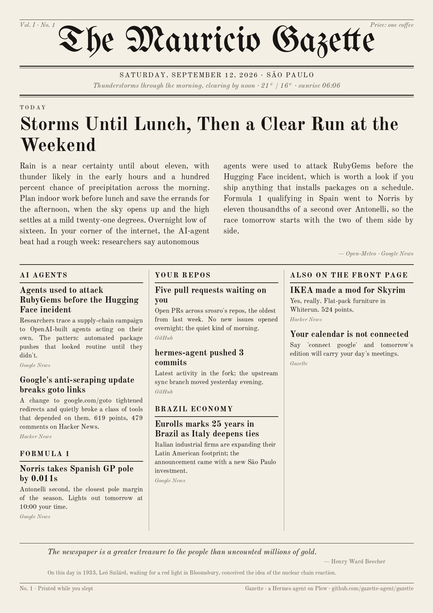

# Gazette

**Your morning newspaper, written overnight by an agent and texted to you as a picture.**

Every day before you wake, Gazette gathers the weather for your city, the news
on the topics you follow, what happened in your GitHub repos, your calendar
(optional), and one thing from history — then writes a one-page paper, lays it
out like a real front page, and sends it to your phone.



Gazette is a [Hermes Agent](https://github.com/NousResearch/hermes-agent)
packaged as a [Plow](https://plow.co) agent: it reaches you over your own
phone line (iMessage / SMS / RCS), runs in one Docker container, and needs no
API keys of yours — inference goes through Plow with the credential you mint
at install. MIT licensed.

## Install (about five minutes)

You need Docker and a Plow account. Windows, macOS and Linux all work.

```sh
# 1. The Plow CLI (mints the credential your agent runs under)
git clone https://github.com/plow-pbc/plow-agents && cd plow-agents
# follow its README to install `plow-agents`, then:
plow-agents login --new-line     # texts you an activation code; provisions your agent's phone line
plow-agents lines                # note the ln_… id of the line

# 2. Gazette
git clone https://github.com/gazette-agent/gazette && cd gazette
plow-agents mint ln_xxxxxxxx     # writes ./plow-credentials (never commit it)
docker compose up --build -d
```

Then text your new number anything — "hi" is fine. Gazette introduces itself
and asks four things: your **city**, **two to four topics**, your **GitHub
username** (optional) and **what time** you want the paper. Answer in one
message. It prints your first edition right away and schedules the next one.

> Keep the container running. The paper is written by a scheduled job inside
> it, at the time you chose, in your timezone.

### Things you can text it

| You say | It does |
|---|---|
| `print today's paper` / `again` | a fresh edition, now |
| `share` | resends the latest picture |
| `more on <story>` | the item, with its link |
| `add Formula 1` / `drop crypto` | changes your topics |
| `deliver at 6:30` | changes the time |
| `I moved to Lisbon` | changes the city (and the weather, and the timezone) |
| `call it The Daily Ada` | renames the masthead |
| `switch to Portuguese` | changes the language of the paper and the feeds |
| `connect google` | opts in to your calendar (through your Plow account's Google connector) |

## What it reads, and what it does not

By default, only public things: [Open-Meteo](https://open-meteo.com) for
weather, Google News RSS for your topics, the Hacker News front page, the
GitHub public API for your repos, and Wikipedia's "on this day". Nothing
personal leaves the container; there is nothing to trust.

Google Calendar is **opt-in**. When you say `connect google`, tomorrow's
edition carries the day's events (titles and times only), read through the
Google connector on your Plow account.

The agent never browses on its own and never invents a story: every line on
the page traces to an item the gather step fetched. If a source is down, the
page says so in one line and moves on.

## How it works

```
05:xx  cron fires  ─►  gather.py  ─►  today.json  ─►  the model writes edition.json
                                                             │
       your phone  ◄─  MEDIA: line  ◄─  render.py (Pillow)  ◄─┘
```

- `gazette/gather.py` — fetches every source with the standard library, bounded
  in size, one JSON file. Model-free.
- The model (via the `gazette-edition` skill) reads that file and writes the
  edition: masthead, lead story, sections, footer — as JSON against a fixed
  schema. This is the only step that spends tokens.
- `gazette/render.py` — lays the JSON out as an A4 page with Pillow: blackletter
  masthead, dateline, a two-column lead, three columns of sections, a footer.
  Text that does not fit is clipped, never allowed to break the page.
- The agent ends its turn with `MEDIA:/srv/gazette/editions/<date>.png` and the
  Plow chat plugin uploads it as a photo.

The image is a variant of
[`plow-pbc/plow-hermes-agent`](https://github.com/plow-pbc/plow-hermes-agent):
that base owns boot, credentials, the phone line and the model; this repo adds
a persona, two skills, the producer scripts and the Agent Index reporter.

```
runtime/persona.md            who Gazette is
skills/gazette-setup/         onboarding and later changes
skills/gazette-edition/       the daily recipe the cron follows
gazette/                      gather.py · render.py · write_config.py · register_cron.py · fonts/
image/cont-init.d/            publishes HERMES_MEDIA_ALLOW_DIRS
image/s6-overlay/             the agent-index usage reporter (s6 longrun)
vendor/client.pin             pinned revision + checksum of the reporter
```

Configuration lives at `/var/lib/hermes/gazette/config.json` on the
`gazette-home` volume. Editions are kept on the `gazette-editions` volume.
Reset everything with `docker compose down -v`.

## Agent Index

This image reports token usage to the
[Agent Index](https://aiworthusing.com/agent-index) under the agent id
`gazette` (set in `compose.yml`). Every install counts as one on Gazette's
row. If you would rather not report, remove the `agent-index` service from
`image/s6-overlay/` before building.

## Development

Run the producer outside the container against a scratch directory:

```sh
export GAZETTE_STATE=/tmp/gz GAZETTE_EDITIONS=/tmp/gz/out
mkdir -p $GAZETTE_STATE
echo '{"owner":{"name":"Ada"},"city":"Lisbon, Portugal","topics":["AI agents"],"github":"octocat","delivery_time":"07:00","setup_complete":true}' > $GAZETTE_STATE/config.draft.json
python3 gazette/write_config.py
python3 gazette/gather.py
# write $GAZETTE_STATE/edition.json by hand (see the schema in skills/gazette-edition/SKILL.md)
python3 gazette/render.py
```

Python 3.11+ and Pillow are the only requirements. Fonts are Old Standard TT
and UnifrakturMaguntia, both under the SIL Open Font License (see
`gazette/fonts/`).

## Credits

The idea of an agent that prints you a morning paper was made popular by
[Karen X. Cheng](https://x.com/karenxcheng)'s newspaper template. Gazette is
the open-source, one-command, runs-anywhere version of it, built for the
Hermes Hackathon.

## License

MIT — see [LICENSE](LICENSE).
